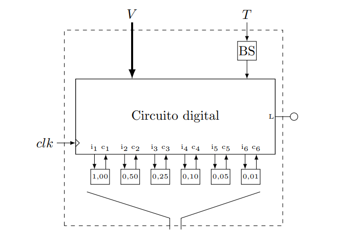
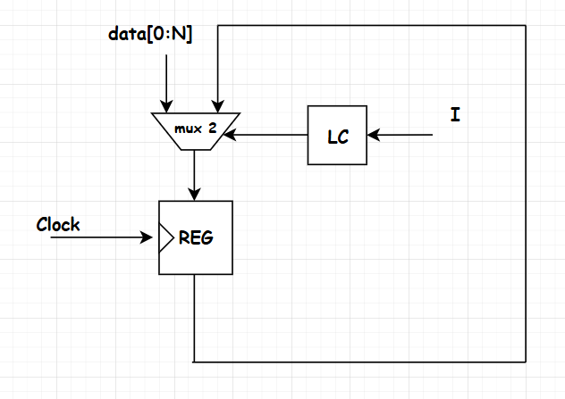
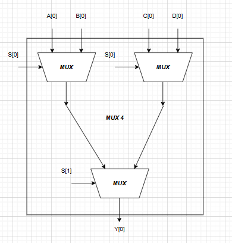
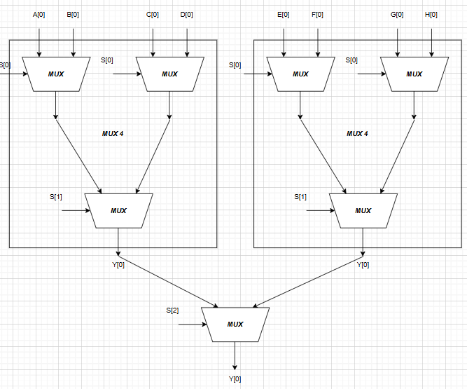
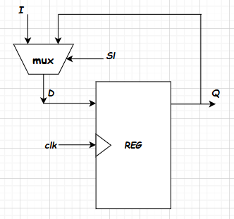
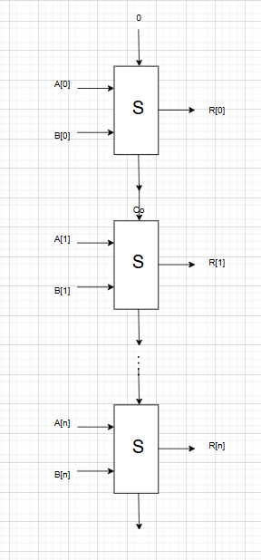
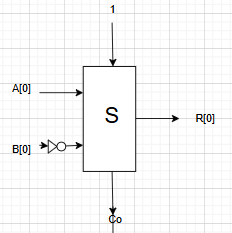
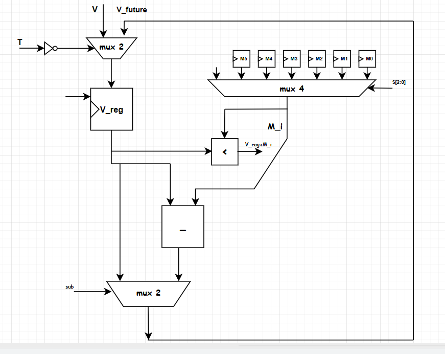
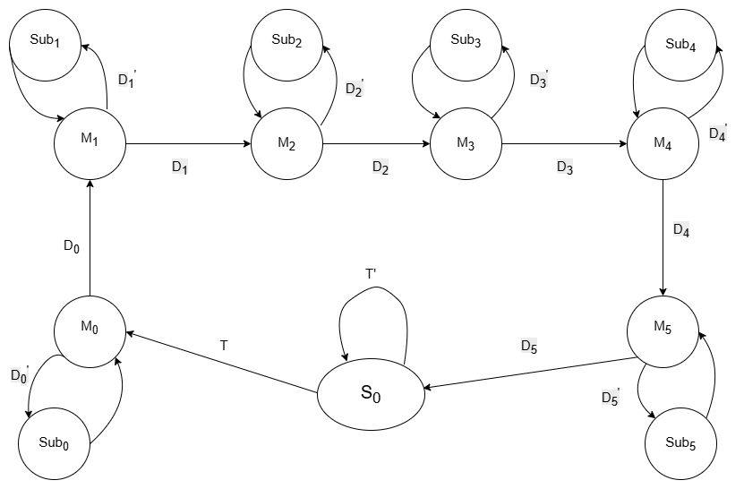
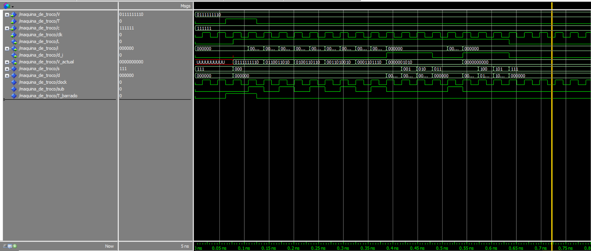

# Projeto 3: Máquina de Moedas - Relatório Técnico

**Disciplina:** Sistemas Digitais (ELE3515)

**Professor:** Samaerni Morais Dias

**Autores:**
* Pedro Arthur Oliveira dos Santos
* LUCAS MATHEUS DA SILVA LIMA

---

# Introdução

Esse relatório descreve os procedimentos realizados para a concepção do terceiro projeto da disciplina de Sistemas Digitais (ELE3515). Foi proposto projetar uma máquina de moedas, para fazer várias operações com dois números de 8 bits, utilizando a abordagem de projeto RTL, utilizando os conceitos de controlador, datapath e máquina de estados de alto nível, também foram desenvolvidos códigos em VHDL, simulação no modelsim e testes no kit da DE2.
O circuito terá uma entrada $V$ de 10 bits para armazenar o valor da entrada a ser trocada, que vai de R$0 a R$10. Além de uma entrada para carregar o valor $T$, e uma entrada de clock para os elementos de memória. As saídas do circuito serão leds que piscarão a cada vez que forem realizadas operações para liberar uma moeda, em tempo real.
Essa máquina de troco será implementada de forma infinita, ou seja, mesmo que algum cofre não tenha moedas, ele vai completar no mínimo com moedas de 1 centavo.

A figura abaixo mostra detalhadamente o esquema inicial do projeto proposto.

*Esquemático do Projeto da Maquina de Troco*

---

# Referencial Teórico

Para este projeto, a teoria principal são as máquinas de estados finitas, e também o método de projeto RTL, que é um projeto a nível de registradores.
No projeto RTL, tem-se dois blocos principais que compõem o componente principal do circuito, nesse caso a máquina de troco, que são os blocos de controle e de caminho de dados (Controller e Datapath), que serão discutidos posteriormente, além dos componentes principais que foram desenvolvidos em projetos anteriores utilizando lógica booleana, além dos registradores de carga paralela para armazenar os dados.
Vamos começar discutindo os componentes principais na próxima seção.

## Comparador Sequencial de 1 bit

Um comparador sequencial de 1 bit é um componente capaz de verificar se uma cadeia de bits é igual, menor ou maior que uma referência, tendo esses três sinais de saída para e sinais de entradas correspondes as cadeias mais a esquerda.
Podemos montar uma tabela para um comparador desse tipo, e em seguida, podemos utilizar a soma de produtos para obter expressões lógicas para esse comparador, e o comparador de 10 bits pode ser feito cascateando vários desses comparadores.
As expressões lógicas para as saídas de comparação são mostradas abaixo:

Um comparador sequencial de 1 bit é um circuito capaz de comparar dois bits ($A$ e $B$) e, com base no resultado da comparação dos bits menos significativos (fornecidos pelas entradas de propagação), determinar se a cadeia de bits representada por $A$ é maior, menor ou igual à representada por $B$.

Esse comparador possui três entradas de propagação:
* `in_gt`: sinal indica que, até o bit anterior, $A > B$;
* `in_eq`: sinal indica que, até o bit anterior, $A = B$;
* `in_lt`: sinal indica que, até o bit anterior, $A < B$.

As saídas indicam o resultado da comparação após considerar o bit atual e são:
* `out_gt`: resultado final $A > B$;
* `out_eq`: resultado final $A = B$;
* `out_lt`: resultado final $A < B$.

A Tabela abaixo apresenta a tabela verdade de um comparador sequencial de 1 bit.

**Tabela Verdade do Comparador Sequencial de 1 Bit com Propagação**
| A | B | `in_gt` | `in_eq` | `in_lt` | `out_gt` | `out_eq` | `out_lt` |
|---|---|---------|---------|---------|----------|----------|----------|
| 0 | 0 | 0       | 1       | 0       | 0        | 1        | 0        |
| 0 | 0 | 1       | 0       | 0       | 1        | 0        | 0        |
| 0 | 0 | 0       | 0       | 1       | 0        | 0        | 1        |
| 0 | 1 | x       | x       | x       | 0        | 0        | 1        |
| 1 | 0 | x       | x       | x       | 1        | 0        | 0        |
| 1 | 1 | 0       | 1       | 0       | 0        | 1        | 0        |
| 1 | 1 | 1       | 0       | 0       | 1        | 0        | 0        |
| 1 | 1 | 0       | 0       | 1       | 0        | 0        | 1        |

Com base na tabela, podemos escrever as expressões lógicas para cada saída utilizando a forma de soma de produtos:

* `out_gt` $= (A \cdot \overline{B}) + (\overline{A} \cdot \overline{B} \cdot \texttt{in_gt}) + (A \cdot B \cdot \texttt{in_gt})$
* `out_eq` $= (\overline{A} \cdot \overline{B} + A \cdot B) \cdot \texttt{in_eq}$
* `out_lt` $= (\overline{A} \cdot B) + (\overline{A} \cdot \overline{B} \cdot \texttt{in_lt}) + (A \cdot B \cdot \texttt{in_lt})$

Essas expressões são utilizadas na construção de comparadores maiores (por exemplo, de 10 bits), conectando comparadores de 1 bit em cascata da direita para a esquerda (do bit menos significativo ao mais significativo), propagando os sinais de comparação apropriados.

## Mux de 2 Canais

Para fazer escolher, normalmente o componente escolhido é o multiplexador, que faz a escolha baseado na chave seletora [vahid].
Podemos fazer um mux de 2 canais, cada canal com 12 bits, para esse propósito.

Um multiplexador 2:1 possui duas entradas de dados ($I_0$ e $I_1$), uma linha de seleção $S$, e uma única saída $Y$.

*Esquemático do multiplexador simples*

A tabela verdade para todas as combinações possíveis de entrada é apresentada a seguir:

**Tabela verdade do multiplexador 2:1.**
| **S** | **$I_0$** | **$I_1$** | **Y** |
|-------|-----------|-----------|-------|
| 0     | 0         | 0         | 0     |
| 0     | 0         | 1         | 0     |
| 0     | 1         | 0         | 1     |
| 0     | 1         | 1         | 1     |
| 1     | 0         | 0         | 0     |
| 1     | 0         | 1         | 1     |
| 1     | 1         | 0         | 0     |
| 1     | 1         | 1         | 1     |

Utilizando agora o conceito de soma de produtos, a expressão que pode ser obtida pela tabela é:

$$ Y = S'I_0I_1' + S'I_0I_1 + SI_0'I_1 + SI_0I_1 $$

agora usando as propriedades da algebra booleana, temos pela propriedade distributiva inversa, que:

$$ Y = S'I_0(I_1' + I_1) + SI_1(I_0' + I_0) $$

Utilizando mais uma vez a propriedade do elemento oposto ou complemento, a expressão simplificada do multiplexador é dada por

$$ Y = S'I_0 + SI_1 $$

Juntando vários multiplexadores em paralelo para cada bit, mantendo a posição dos bits referente a cada canal, é possível fazer um multiplexador que transmita um vetor de bits, ao invés de um único bit.
Nesse projeto, as entradas para esses multiplexadores são vetores de 12 bits, que são usados para representar as variáveis principais de contagem.

Nesse contexto, podemos representar as entradas $I_0$ e $I_1$ vetorialmente e a equação de saída do multiplexador se torna:

$$ Y^{(n)} = S'I_0^{(n)} + SI_1^{(n)} $$

## Registradores em RTL

No projeto RTL, que significa projeto em nível de transferência entre registradores, abstraímos a parte da lógica combinacional para ser colocada diretamente como a chave de um mux de carga paralela, para o circuito ficar concentrado na lógica dos registradores.

*Registrador Básico*

Podemos dizer que a chave seletora do MUX é função das entradas de controle:

$$ Sl = f(I) $$

E o que será carregado no registrador dependerá totalmente do controle que vem da máquina de estados, resultando no carregamento ou não de um novo valor.

## Maquina de Estados Finitos

Muitas vezes os nossos circuitos podem ser divididos em estados, de acordo com o valor das suas variáveis em determinados tempos [tocci].
Para isso, foi desenvolvida uma representação em formato de diagrama que representa todos esses estados de uma vez, e pode-se montar o circuito digital a partir disso, essa representação é chamada de máquina de estados finitos, e é fundamental em muitos projetos de sistemas digitais.

### Variáveis de Estado

As variáveis de estado são as variáveis que fazem a transição de um estado para outro.

## Método de Projeto RTL

O método de projeto RTL (Register Transfer Level) tem esse nome justamente porque os projetos neste método podem ser projetados à nível de registradores e máquinas de estados.
Neste tipo de projeto, tem-se dois blocos principais que realizam as operações com os dados (datapath) e que fazem a lógica dos estados (Controlador), que trocam sinais entre si e podem ou não receber entradas externas.

### Controlador

A arquitetura do controlador é literalmente o funcionamento a máquina de estados de baixo nível, que tem como entrada a variável $T$, além de sinais que vem do próprio datapath.

### Datapath

A arquitetura do datapath se resume aos registradores de dados e as operações que acontecem com esses nesse bloco do circuito.
Para o caso da máquina de troco, o bloco do datapath contemplará todas as operações de decisão para verificação quantas moedas da cada uma irá sair sequencialmente na máquina.

A figura abaixo mostra a arquitetura de um projeto RTL.

*Arquitetura de um Projeto RTL*

---

# Projeto

## Projetando os blocos do circuito

A máquina de troco é um circuito que pode ser dividido como um projeto RTL em dois blocos principais, com operações de subtração, comparação, e multiplexação. Abaixo serão descritos todos esses blocos principais que compõem esse sistema digital.

## Multiplexador de 8 Canais

Para fazer a escolha de qual moeda deve ser comparada e subtraída, precisamos de um componente que consiga escolher qual moeda irá entrar na comparação, conforme as operações que acontecem no bloco de controle.
Um componente fundamental para escolher a saída é o multiplexador, ele permite que apenas os bits escolhidos pela chave seletora saiam.
Podemos construir esse multiplexador de 16 canais, já que 15 não é uma potência de 2, utilizando vários multiplexadores simples, vamos começar agrupando 3 multiplexadores, para o número de entradas ir de duas para quatro.

Para conseguirmos um multiplexador de quatro canais, precisamos juntar dois multiplexadores simples em paralelo, e colocar um em série, como mostra o arranjo abaixo:

*Esquemático do multiplexador de 4 bits*

Agora podemos evoluir isso, colocando dois multiplexadores de 4 canais em paralelo junto com um simples em série, para poder multiplexar 8 canais, então temos finalmente

*Esquemático do multiplexador de 8 bits*

que será utilizado neste projeto para escolher a entrada do subtrator que irá subtrair a outra.

## Comparador de 12 bits

Para continuar ou não a contagem, precisamos verificar se o número excede o máximo ou é menor que o mínimo, há algumas formas de fazer isso e o comparador de magnitude é a forma fundamental, ainda que a entrada esteja em bcd, podemos concatenar os dígitos e fazer a comparação de forma igual.

## Decodificador 3x6 com Enable

Como estamos multiplexando as moedas, então precisaremos de um sinal para mandar para o bloco de controle que identifica a moeda atual, a partir o resultado do comparador do valor do registrador da moeda atual com a saída do multiplexador de moedas, para isso, podemos usar um decodificador, que irá receber a chave S, que é uma entrada vinda do bloco de comando, e o enable que será exatamente o resultado da saída da comparação.
A tabela verdade deste decodificador é mostrada abaixo:

**Tabela Verdade do Decodificador 3x6 com Enable**
| e_n | s2 | s1 | s0 | d5 | d4 | d3 | d2 | d1 | d0 |
|-----|----|----|----|----|----|----|----|----|----|
| 1   | 0  | 0  | 0  | 0  | 0  | 0  | 0  | 0  | 1  |
| 1   | 0  | 0  | 1  | 0  | 0  | 0  | 0  | 1  | 0  |
| 1   | 0  | 1  | 0  | 0  | 0  | 0  | 1  | 0  | 0  |
| 1   | 0  | 1  | 1  | 0  | 0  | 1  | 0  | 0  | 0  |
| 1   | 1  | 0  | 0  | 0  | 1  | 0  | 0  | 0  | 0  |
| 1   | 1  | 0  | 1  | 1  | 0  | 0  | 0  | 0  | 0  |
| X   | X  | X  | X  | 0  | 0  | 0  | 0  | 0  | 0  |

Assim, por soma de produtos conseguimos achar a expressão lógica corresponde de cada saída $d$, dadas por:

1.  $$ d_0 = e_n \cdot s_2' \cdot s_1' \cdot s_0' $$
2.  $$ d_1 = e_n \cdot s_2' \cdot s_1' \cdot s_0 $$
3.  $$ d_2 = e_n \cdot s_2' \cdot s_1 \cdot s_0' $$
4.  $$ d_3 = e_n \cdot s_2' \cdot s_1 \cdot s_0 $$
5.  $$ d_4 = e_n \cdot s_2 \cdot s_1' \cdot s_0' $$
6.  $$ d_5 = e_n \cdot s_2 \cdot s_1' \cdot s_0 $$

## Registradores

Um registrador é um circuito feito para guardar o valor de um bit no seu interior até que ele mude, para isso precisamos de circuitos flip flops e também multiplexadores para controlar quando um registrador deve ser alterado (carregado) e quando deve permanecer com o mesmo valor [vahid].
Podemos implementar um registrador utilizando um Flip-flop D e um multiplexador, como é mostrado na figura abaixo.

*Registrador Básico*

A chave seletora do mux de um registrador é chamada de *load*, e seu nome tem justamente o significado de carregar um valor para a saída do registrador, somente quando essa chave for ativa.

A equação do multiplexador é dada por

$$ D = \overline{load} \cdot Q + load \cdot I $$

Porém a saída do registrador é o valor da entrada, apenas nas bordas de subida, assim

$$ Q^{i+1} = (\overline{load} \cdot Q^i + load \cdot I) \cdot clk^{\uparrow} $$

Ou seja, o valor $Q$ guardado no registrador só vai ser determinado pela entrada I quando a entrada $load$ estiver ativa e houver uma borda de subida, e isso é a forma fundamental de armazenamento de bits, que é conhecido como registrador de carga paralela.

## Somador de 8 bits

Utilizando o componente somador completo de 1 bit, mostrado anteriormente, é possível, cascateando n somadores em série, fazer um somador justamente de n bits, que nesse caso $n = 8$, como é mostrado abaixo:

*Esquemático do Somador de 8 Bits*

## Subtrator de 8 bits

A ideia com o subtrator funciona de forma similar, a diferença é que vamos usar o conceito de complemento A2 para fazer essa operação, negando a entrada que será subtraída da outra e adicionando 1 no *carry in*, como mostra a figura abaixo:

*Esquemático do subtrator de 8 bits*

Esse subtrator pode valer tanto para 1 tanto para n bits, se usarmos o somador completo, que recebe um número de 8 bits como um vetor, podemos abstrair e assumir que as operações são feitas elemento a elemento, e temos um subtrator completo.

## Divisor de Frequência

O divisor de frequência é um circuito com Flip-flop JK, que tem a característica de dividir a frequência do sinal de clock da entrada por dois.
A configuração do flip-flop JK como dobrador de frequência é mostrada na figura abaixo:

*Divisor de Frequência*

Aplicando a equação característica do flip-flop nessa configuração, temos

$$ Q^{\text{i+1}} = 1 \cdot \overline{Q^i} + \overline{1} \cdot Q^{i} = \overline{Q^i} \cdot clk^{->} $$

Ou seja, se demora um período $T$ para a borda de subida acontecer, irá demorar T segundos para a saída ir do positivo pro negativo ou vice versa, ou seja, um ciclo completo agora se dará em um período de $2T$, assim, se o período é dobrado, a frequência é dividida por 2, então temos finalmente a relação fundamental do divisor de frequência:

$$ \omega_Q = \frac{\omega_{clk}}{2} $$

## Datapath

Foi desenvolvida uma arquitetura para o datapath baseado na operação de dar o troco das moedas aos poucos, e foram utilizados componentes como subtratores, multiplexadores, comparadores e registradores.

O diagrama de blocos do datapath é mostrado abaixo:

*Bloco Datapath da Máquina de Troco.*

## Máquina de Estados(Controlador)

Foi feito uma Máquina de Estados para identificar o funcionamento da máquina de troco. Segue abaixo a figura:

*Máquina de Estado da Máquina de Troco.*

Onde $M_i$, sendo $i = 0,1,...,5$ é o estado da moeda atual. O estado $M_0$ é para a moeda de R$1,00, $M_1$ é o estado da moeda de R$0,50 e assim sucessivamente até chegar o estado $M_5$ que é o estado da moeda de R$0,01. Sendo que em cada estado, a cada ciclo, uma moeda é saída do cofre. Após passar em todos os estados, volta ao estado inicial $S_0$.

Na Máquina de Estado $Sub_i$, sendo $i = 0,1,...,5$, é um subtrator do estado atual. Por exemplo, $Sub_0$ é o subtrator do estado $M_0$, onde vai pegar o valor atual do troco e subtrair R$1,00, caso o sinal $D_0$ seja negado. Se o sinal $D_0$ não for negado vai para o próximo estado, que nesse caso é o estado $M_1$. E assim sucessivamente até chegar o estado $M_5$ e voltar para o estado inicial $S_0$. Lembrando que a máquina de troco é infinita para moedas de R$0,01. Ou seja, sempre será possível ter troco.

---

# Resultados

Depois da implementação do código em VHDL, foi feita a simulação no modelsim.

## Simulação no Modelsim

Foi então realizada uma simulação, com um clock de $f = 32 \text{ GHz}$, e um teste com um valor de R$5,10 a ser trocado, e o botão T foi pressionado em $1 \text{ ns}$, começando a operação de dar troco.

Foi percebido na simulação que esse valor foi dado em troco por 5 moedas de 1 real, seguidas de 1 moeda de 10 centavos, como é mostrado abaixo:

*Primeira Parte da Simulação no Modelsim*

É possível observar na imagem acima que o valor de R$5,10 trocado, resulta em 5 moedas de R$1, e uma moeda de 10 centavos, como esperado, as subtrações foram feitas de modo sequencial ascendendo os leds i correspondentes para "liberar" a moeda.

## Implementação no Kit da DE2

No kit da DE2, foram realizados as análises de sintaxe, com alguns warnings mas sem nenhum erro, além disso também foi realizada a compilação completa, e o planejamento de pinos de acordo com o manual da Altera [manual_DE2].

---

# Conclusão

Foi então concluído o terceiro projeto da disciplina de Sistemas Digitais, utilizando como exemplo códigos de implementação de máquinas de estados fornecidas pelo professor no github, com a implementação no código em VHDL utilizando componentes discutidos na seção de projetos e simulação realizada no Modelsim e também os testes realizados no kit da DE2.
